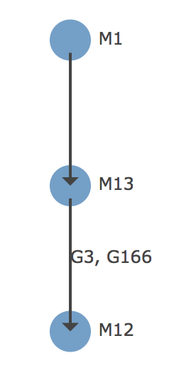

# MaxYield: Build the next microbe of super yield

**MaxYield** is a microbe yield prediction model embeded into a dashboard together with analytics parts. This dashboard framework can be applied to the general synthetic biology industry / research field. 

This repo contains all the back-end data files and the code for running the dashboard locally. The `./data/` folder contains all the data files and the model. The `./src/` folder contains the source code.

## How to run the dashboard from Terminal

In Terminal, type:
```python
cd MaxYield
python3 ./src/dashboard.py
```

This will return something like the following:
```
 * Serving Flask app "dashboard" (lazy loading)
 * Environment: production
   WARNING: Do not use the development server in a production environment.
   Use a production WSGI server instead.
 * Debug mode: off
 * Running on http://127.0.0.1:8050/ (Press CTRL+C to quit)
```

Then go to that URL (in this case http://127.0.0.1:8050/) using your browser, the dashboard will then show up. 

## Library dependencies:
* `Python 3` (Please do *not* use `Python 2`)
* `dash`
* `networkx`
* `plotly`
* `pandas`
* `numpy`
* `pickle`

## How to use the Dashboard
### Microbe Comparison
This section allows you to compare any 2 microbes (e.g. M1) regarding the overall historical yields.

### Microbe History
This section allows you to retrieve the engineering history of a given microbe. 
e.g. For `M12`, the following graph was returned:



Here,  `M12` was built by:
1. Built `M13` from `M1`.
2. Built `M12` from `M13` by introducing genetic components `G3` and `G166` into `M13`.

### Which microbe to build next?
This will return the expected yield of the new microbe that you would like to build based on the model I built.

### Microbe Engineering Plan -- Limited amount of genetic components
If you would like to build a new micro by introducing a fixed amount of genetic components, this returns the combinations that you can try with the expected yields listed in decreasing order (again, using the model I build).

### Microbe Engineering Plan -- Start from a current microbe
If you would like to build a new microbe from a current one, this section returns the genetic components you can try with the expected yields.